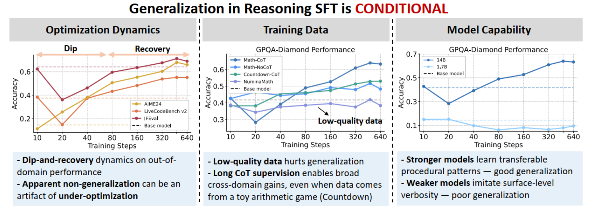

<div align="center">

# Rethinking Generalization in Reasoning SFT: A Conditional Analysis on Optimization, Data, and Model Capability

[](https://arxiv.org/abs/2604.06628) [](https://github.com/Nebularaid2000/rethink_sft_generalization) [](https://huggingface.co/collections/jasonrqh/rethink-sft-generalization) [](https://modelscope.cn/collections/nebularaid/Rethink_SFT_generalization)


</div>


<div align="center">
  
</div>


## Overview
- [News](#News)
- [Introduction](#introduction)
- [Repository Structure](#repository-structure)
- [Getting Started](#getting-started)
- [Usage](#usage)
- [Open-source Models](#open-source-models)
- [Open-source Datasets](#open-source-datasets)
- [Evaluation](#evaluation)
- [Citation](#citation)

## 📢 News
- **[2026/04/22]** Environment setup is now available. You can either install dependencies with `requirements.txt` or use our Docker Hub image: `jasonrqh/sft-generalization:v0.1`.
- **[2026/04/15]** We are glad that our paper **has helped guide practical model training** of [Jackrong/Gemopus-4-31B-it](https://huggingface.co/Jackrong/Gemopus-4-31B-it), which is another impressive release from the author of [Qwen3.5-27B-Claude-4.6-Opus-Reasoning-Distilled](https://huggingface.co/Jackrong/Qwen3.5-27B-Claude-4.6-Opus-Reasoning-Distilled). Check these models if you are interested.
- **[2026/04/11]** We release the raw dataset before filtering and random selection (44k queries, each with 32 responses): [Huggingface](https://huggingface.co/datasets/jasonrqh/Math-CoT-44k-Qwen3-32b-n32-16384-with-logprob-and-entropy), [Modelscope](https://modelscope.cn/datasets/nebularaid/Math-CoT-44k-Qwen3-32b-n32-16384-with-logprob-and-entropy). **We also release the token-level log probability and entropy from the teacher model**. We did not make full use of this dataset, and believe that it might be useful for future research.
- **[2026/04/10]** Our paper is available on [Huggingface daily paper](https://huggingface.co/papers/2604.06628). If you enjoy our work, we warmly invite you to **upvote** it on Huggingface!
- **[2026/04/09]** Our paper is available on [arXiv](https://arxiv.org/abs/2604.06628). We open-sourced all models and datasets in [this Huggingface collection](https://huggingface.co/collections/jasonrqh/rethink-sft-generalization).


## Introduction

The paper revisits the prevailing narrative that "SFT memorizes, RL generalizes", mainly focusing on reasoning SFT (with long-CoT supervision). Our core conclusion is that **generalization in reasoning SFT is highly conditional**, jointly shaped by:
- Optimization dynamics
- Training data quality and structure
- Base model capability

Main findings:

1. Cross-domain performance often follows a **dip-and-recovery** trajectory, so short training can underestimate final generalization.
2. Verified long-CoT supervision yields stronger transfer, while low-quality data can produce misleading non-generalization signals.
3. Stronger base models are more likely to internalize transferable procedural reasoning patterns and generalize better.
4. Generalization is asymmetric: reasoning improves, but safety can degrade.


## Repository Structure

```text
|-- training_scripts/                 # SFT scripts used for the paper experiments
|-- evaluation/                       # Unified evaluation toolkit (lm-eval-harness/evalchemy/math/alpaca/safety)
|-- verl/                             # Core training framework (based on verl)
|   |-- trainer/fsdp_sft_trainer_ours.py
|   `-- utils/dataset/sft_dataset.py
```


## Getting Started

### 1) Environment setup

You can set up the environment in either of the following ways:

```bash
# Option 1: install dependencies from requirements.txt
pip install -r requirements.txt

# Option 2: use our Docker Hub image
docker pull jasonrqh/sft-generalization:v0.1
```

Main dependencies:
- Core training/runtime: `torch`, `transformers`, `datasets`, `accelerate`, `hydra-core`, `ray`, `tensordict`, `peft`, `pyarrow`, `wandb`, `torchdata`,`flash-attn`
- Evaluation: `numpy`, `pandas`, `scikit-learn`, `matplotlib`, `fastapi`, `vllm`


### 2) Required script edits before training

Update placeholders in `training_scripts/*.sh`:

1. `ROOT_DIR=/path/to/this/repo`
2. `TRAIN_DATA=/path/to/{dataset_name}`
3. `WANDB_API_KEY=your_wandb_key`

`MODEL_PATH` is already set in the provided scripts. Change it only if you want to use a different base model.

Distributed variables are expected from the runtime environment:
1. `NODE_COUNT`
2. `PROC_PER_NODE`
3. `NODE_RANK`
4. `MASTER_ADDR`

We trained all models on 8 H200 GPUs. If you encounter OOM errors, consider using a smaller micro_batch_size.

### 3) Training data schema

Current scripts call `verl.trainer.fsdp_sft_trainer_ours` with:

1. `data.prompt_key=message`
2. `data.response_key=response`
3. `data.advantage_key=advantage`

Each parquet row should include at least:

1. `message` (chat-message list)
2. `response` (string)
3. `advantage` (scalar, commonly just `1.0`)


## Usage

### 1) Run training (example)

```bash
bash training_scripts/Qwen3-14B_Math-CoT-20k_lr5e-5_ep8_bs256.sh
```

### 2) Representative scripts aligned with paper settings

1. Default Math-CoT setting  
   `training_scripts/Qwen3-14B_Math-CoT-20k_lr5e-5_ep8_bs256.sh`
2. Short-training replication  
   `training_scripts/Qwen3-14B_Math-CoT-20k_lr5e-5_ep1_bs256.sh`
3. Smaller LR setting  
   `training_scripts/Qwen3-14B_Math-CoT-20k_lr1e-5_ep1_bs256.sh`
4. Overfitting stress-test schedules  
   `training_scripts/Qwen3-14B_Math-CoT-20k_lr5e-5_ep16_bs256_ConstLR.sh`  
   `training_scripts/Qwen3-14B_Math-CoT-20k_lr1e-4_ep16_bs256_ConstLR.sh`
5. Data variants  
   `training_scripts/Qwen3-14B_Math-NoCoT-20k_lr5e-5_ep8_bs256.sh`  
   `training_scripts/Qwen3-14B_Countdown-CoT-20k_lr5e-5_ep8_bs256.sh`  
   `training_scripts/Qwen3-14B_DeepSeek-R1-20k_lr5e-5_ep8_bs256.sh`
   `training_scripts/Qwen3-14B_Numina-Math-20k_lr5e-5_ep8_bs256.sh`
6. Capability scaling (Qwen3 1.7B/4B/8B/14B)  
   `training_scripts/Qwen3-1.7B_Math-CoT-20k_lr5e-5_ep8_bs256.sh`  
   `training_scripts/Qwen3-4B_Math-CoT-20k_lr5e-5_ep8_bs256.sh`  
   `training_scripts/Qwen3-8B_Math-CoT-20k_lr5e-5_ep8_bs256.sh`  
   `training_scripts/Qwen3-14B_Math-CoT-20k_lr5e-5_ep8_bs256.sh`

### 3) Merge FSDP checkpoints

```bash
python -m verl.model_merger merge \
  --backend fsdp \
  --local_dir /path/to/ckpt/global_step_640 \
  --target_dir /path/to/ckpt/merged_step640 \
  --trust_remote_code
```

Batch merge helper:

```bash
bash training_scripts/model_merger.sh
```

Before using `model_merger.sh`, update `ckpt_path_list` in the script (for example `/path/to/model/global_step_640`).


## Open-source Models

We have open-sourced **ALL** models trained in our experiments, including the **intermediate checkpoints** (you can find them in the `stepxxx` folder in the repo).

Note that the following model list may include repeated entries, as it is organized by the experiments and conclusions presented in the paper.

| Model Name | Huggingface | ModelScope |
| --- | --- | --- |
| **Weak cross-domain generalization is more pronounced under short training and smaller learning rates (refer to Sec. 3.1; App. C.1, Table 4)** |  |  |
| Qwen3-14B_Math-CoT-20k_lr5e-5_ep1_bs256 | [Huggingface](https://huggingface.co/jasonrqh/Qwen3-14B_Math-CoT-20k_lr5e-5_ep1_bs256) | [ModelScope](https://modelscope.cn/models/nebularaid/Qwen3-14B_Math-CoT-20k_lr5e-5_ep1_bs256) |
| Qwen3-14B_Math-CoT-20k_lr1e-5_ep1_bs256 | [Huggingface](https://huggingface.co/jasonrqh/Qwen3-14B_Math-CoT-20k_lr1e-5_ep1_bs256) | [ModelScope](https://modelscope.cn/models/nebularaid/Qwen3-14B_Math-CoT-20k_lr1e-5_ep1_bs256) |
| Qwen3-14B_Math-CoT-20k_lr1e-5_ep2_bs256 | [Huggingface](https://huggingface.co/jasonrqh/Qwen3-14B_Math-CoT-20k_lr1e-5_ep2_bs256) | [ModelScope](https://modelscope.cn/models/nebularaid/Qwen3-14B_Math-CoT-20k_lr1e-5_ep2_bs256) |
| **Apparent non-generalization can be an under-optimization artifact, with a dip-and-recovery pattern under extended training (refer to Sec. 3.1-3.2, Fig. 3)** |  |  |
| Qwen3-14B_Math-CoT-20k_lr5e-5_ep8_bs256 | [Huggingface](https://huggingface.co/jasonrqh/Qwen3-14B_Math-CoT-20k_lr5e-5_ep8_bs256) | [ModelScope](https://modelscope.cn/models/nebularaid/Qwen3-14B_Math-CoT-20k_lr5e-5_ep8_bs256) |
| Qwen3-8B_Math-CoT-20k_lr5e-5_ep8_bs256 | [Huggingface](https://huggingface.co/jasonrqh/Qwen3-8B_Math-CoT-20k_lr5e-5_ep8_bs256) | [ModelScope](https://modelscope.cn/models/nebularaid/Qwen3-8B_Math-CoT-20k_lr5e-5_ep8_bs256) |
| InternLM2.5-20B_Math-CoT-20k_lr5e-5_ep8_bs256 | [Huggingface](https://huggingface.co/jasonrqh/InternLM2.5-20B_Math-CoT-20k_lr5e-5_ep8_bs256) | [ModelScope](https://modelscope.cn/models/nebularaid/InternLM2.5-20B_Math-CoT-20k_lr5e-5_ep8_bs256) |
| **The above optimization dynamics remain robust under a different teacher model (refer to App. C.2, Fig. 7)** |  |  |
| Qwen3-14B_DeepSeek-R1-20k_lr5e-5_ep8_bs256 | [Huggingface](https://huggingface.co/jasonrqh/Qwen3-14B_DeepSeek-R1-20k_lr5e-5_ep8_bs256) | [ModelScope](https://modelscope.cn/models/nebularaid/Qwen3-14B_DeepSeek-R1-20k_lr5e-5_ep8_bs256) |
| Qwen3-8B_DeepSeek-R1-20k_lr5e-5_ep8_bs256 | [Huggingface](https://huggingface.co/jasonrqh/Qwen3-8B_DeepSeek-R1-20k_lr5e-5_ep8_bs256) | [ModelScope](https://modelscope.cn/models/nebularaid/Qwen3-8B_DeepSeek-R1-20k_lr5e-5_ep8_bs256) |
| InternLM2.5-20B_DeepSeek-R1-20k_lr5e-5_ep8_bs256 | [Huggingface](https://huggingface.co/jasonrqh/InternLM2.5-20B_DeepSeek-R1-20k_lr5e-5_ep8_bs256) | [ModelScope](https://modelscope.cn/models/nebularaid/InternLM2.5-20B_DeepSeek-R1-20k_lr5e-5_ep8_bs256) |
| **Under a fixed 640-step budget, repeated exposure is more effective than one-pass coverage (refer to Sec. 3.3, Table 1)** |  |  |
| Qwen3-14B_Math-CoT-20k_lr5e-5_ep8_bs256 | [Huggingface](https://huggingface.co/jasonrqh/Qwen3-14B_Math-CoT-20k_lr5e-5_ep8_bs256) | [ModelScope](https://modelscope.cn/models/nebularaid/Qwen3-14B_Math-CoT-20k_lr5e-5_ep8_bs256) |
| Qwen3-14B_Math-CoT-2.5k_lr5e-5_ep8_bs32 | [Huggingface](https://huggingface.co/jasonrqh/Qwen3-14B_Math-CoT-2.5k_lr5e-5_ep8_bs32) | [ModelScope](https://modelscope.cn/models/nebularaid/Qwen3-14B_Math-CoT-2.5k_lr5e-5_ep8_bs32) |
| Qwen3-14B_Math-CoT-20k_lr5e-5_ep1_bs32 | [Huggingface](https://huggingface.co/jasonrqh/Qwen3-14B_Math-CoT-20k_lr5e-5_ep1_bs32) | [ModelScope](https://modelscope.cn/models/nebularaid/Qwen3-14B_Math-CoT-20k_lr5e-5_ep1_bs32) |
| **Overfitting symptoms emerge mainly under combined aggressive schedules (refer to Sec. 3.4, Fig. 4; App. C.4)** |  |  |
| Qwen3-14B_Math-CoT-20k_lr5e-5_ep8_bs256 | [Huggingface](https://huggingface.co/jasonrqh/Qwen3-14B_Math-CoT-20k_lr5e-5_ep8_bs256) | [ModelScope](https://modelscope.cn/models/nebularaid/Qwen3-14B_Math-CoT-20k_lr5e-5_ep8_bs256) |
| Qwen3-14B_Math-CoT-20k_lr5e-5_ep16_bs256 | [Huggingface](https://huggingface.co/jasonrqh/Qwen3-14B_Math-CoT-20k_lr5e-5_ep16_bs256) | [ModelScope](https://modelscope.cn/models/nebularaid/Qwen3-14B_Math-CoT-20k_lr5e-5_ep16_bs256) |
| Qwen3-14B_Math-CoT-20k_lr5e-5_ep16_bs256_ConstLR | [Huggingface](https://huggingface.co/jasonrqh/Qwen3-14B_Math-CoT-20k_lr5e-5_ep16_bs256_ConstLR) | [ModelScope](https://modelscope.cn/models/nebularaid/Qwen3-14B_Math-CoT-20k_lr5e-5_ep16_bs256_ConstLR) |
| Qwen3-14B_Math-CoT-20k_lr1e-4_ep16_bs256_ConstLR | [Huggingface](https://huggingface.co/jasonrqh/Qwen3-14B_Math-CoT-20k_lr1e-4_ep16_bs256_ConstLR) | [ModelScope](https://modelscope.cn/models/nebularaid/Qwen3-14B_Math-CoT-20k_lr1e-4_ep16_bs256_ConstLR) |
| **Training data quality and structure jointly shape generalization (refer to Sec. 4, Table 2)** |  |  |
| Qwen3-14B_Math-CoT-20k_lr5e-5_ep8_bs256 | [Huggingface](https://huggingface.co/jasonrqh/Qwen3-14B_Math-CoT-20k_lr5e-5_ep8_bs256) | [ModelScope](https://modelscope.cn/models/nebularaid/Qwen3-14B_Math-CoT-20k_lr5e-5_ep8_bs256) |
| Qwen3-14B_Math-NoCoT-20k_lr5e-5_ep8_bs256 | [Huggingface](https://huggingface.co/jasonrqh/Qwen3-14B_Math-NoCoT-20k_lr5e-5_ep8_bs256) | [ModelScope](https://modelscope.cn/models/nebularaid/Qwen3-14B_Math-NoCoT-20k_lr5e-5_ep8_bs256) |
| Qwen3-14B_Numina-Math-20k_lr5e-5_ep8_bs256 | [Huggingface](https://huggingface.co/jasonrqh/Qwen3-14B_Numina-Math-20k_lr5e-5_ep8_bs256) | [ModelScope](https://modelscope.cn/models/nebularaid/Qwen3-14B_Numina-Math-20k_lr5e-5_ep8_bs256) |
| Qwen3-14B_Countdown-CoT-20k_lr5e-5_ep8_bs256 | [Huggingface](https://huggingface.co/jasonrqh/Qwen3-14B_Countdown-CoT-20k_lr5e-5_ep8_bs256) | [ModelScope](https://modelscope.cn/models/nebularaid/Qwen3-14B_Countdown-CoT-20k_lr5e-5_ep8_bs256) |
| Qwen3-8B_Math-CoT-20k_lr5e-5_ep8_bs256 | [Huggingface](https://huggingface.co/jasonrqh/Qwen3-8B_Math-CoT-20k_lr5e-5_ep8_bs256) | [ModelScope](https://modelscope.cn/models/nebularaid/Qwen3-8B_Math-CoT-20k_lr5e-5_ep8_bs256) |
| Qwen3-8B_Math-NoCoT-20k_lr5e-5_ep8_bs256 | [Huggingface](https://huggingface.co/jasonrqh/Qwen3-8B_Math-NoCoT-20k_lr5e-5_ep8_bs256) | [ModelScope](https://modelscope.cn/models/nebularaid/Qwen3-8B_Math-NoCoT-20k_lr5e-5_ep8_bs256) |
| Qwen3-8B_Numina-Math-20k_lr5e-5_ep8_bs256 | [Huggingface](https://huggingface.co/jasonrqh/Qwen3-8B_Numina-Math-20k_lr5e-5_ep8_bs256) | [ModelScope](https://modelscope.cn/models/nebularaid/Qwen3-8B_Numina-Math-20k_lr5e-5_ep8_bs256) |
| Qwen3-8B_Countdown-CoT-20k_lr5e-5_ep8_bs256 | [Huggingface](https://huggingface.co/jasonrqh/Qwen3-8B_Countdown-CoT-20k_lr5e-5_ep8_bs256) | [ModelScope](https://modelscope.cn/models/nebularaid/Qwen3-8B_Countdown-CoT-20k_lr5e-5_ep8_bs256) |
| InternLM2.5-20B_Math-CoT-20k_lr5e-5_ep8_bs256 | [Huggingface](https://huggingface.co/jasonrqh/InternLM2.5-20B_Math-CoT-20k_lr5e-5_ep8_bs256) | [ModelScope](https://modelscope.cn/models/nebularaid/InternLM2.5-20B_Math-CoT-20k_lr5e-5_ep8_bs256) |
| InternLM2.5-20B_Math-NoCoT-20k_lr5e-5_ep8_bs256 | [Huggingface](https://huggingface.co/jasonrqh/InternLM2.5-20B_Math-NoCoT-20k_lr5e-5_ep8_bs256) | [ModelScope](https://modelscope.cn/models/nebularaid/InternLM2.5-20B_Math-NoCoT-20k_lr5e-5_ep8_bs256) |
| InternLM2.5-20B_Numina-Math-20k_lr5e-5_ep8_bs256 | [Huggingface](https://huggingface.co/jasonrqh/InternLM2.5-20B_Numina-Math-20k_lr5e-5_ep8_bs256) | [ModelScope](https://modelscope.cn/models/nebularaid/InternLM2.5-20B_Numina-Math-20k_lr5e-5_ep8_bs256) |
| InternLM2.5-20B_Countdown-CoT-20k_lr5e-5_ep8_bs256 | [Huggingface](https://huggingface.co/jasonrqh/InternLM2.5-20B_Countdown-CoT-20k_lr5e-5_ep8_bs256) | [ModelScope](https://modelscope.cn/models/nebularaid/InternLM2.5-20B_Countdown-CoT-20k_lr5e-5_ep8_bs256) |
| **Higher-capability models internalize transferable reasoning patterns more effectively and generalize better (refer to Sec. 5, Fig. 5)** |  |  |
| Qwen3-1.7B_Math-CoT-20k_lr5e-5_ep8_bs256 | [Huggingface](https://huggingface.co/jasonrqh/Qwen3-1.7B_Math-CoT-20k_lr5e-5_ep8_bs256) | [ModelScope](https://modelscope.cn/models/nebularaid/Qwen3-1.7B_Math-CoT-20k_lr5e-5_ep8_bs256) |
| Qwen3-4B_Math-CoT-20k_lr5e-5_ep8_bs256 | [Huggingface](https://huggingface.co/jasonrqh/Qwen3-4B_Math-CoT-20k_lr5e-5_ep8_bs256) | [ModelScope](https://modelscope.cn/models/nebularaid/Qwen3-4B_Math-CoT-20k_lr5e-5_ep8_bs256) |
| Qwen3-8B_Math-CoT-20k_lr5e-5_ep8_bs256 | [Huggingface](https://huggingface.co/jasonrqh/Qwen3-8B_Math-CoT-20k_lr5e-5_ep8_bs256) | [ModelScope](https://modelscope.cn/models/nebularaid/Qwen3-8B_Math-CoT-20k_lr5e-5_ep8_bs256) |
| Qwen3-14B_Math-CoT-20k_lr5e-5_ep8_bs256 | [Huggingface](https://huggingface.co/jasonrqh/Qwen3-14B_Math-CoT-20k_lr5e-5_ep8_bs256) | [ModelScope](https://modelscope.cn/models/nebularaid/Qwen3-14B_Math-CoT-20k_lr5e-5_ep8_bs256) |
| **The capability-dependent trend extends to another model family (refer to App. C.2/C.5, Fig. 8/14/15)** |  |  |
| Qwen2.5-1.5B_Math-CoT-20k_lr5e-5_ep8_bs256 | [Huggingface](https://huggingface.co/jasonrqh/Qwen2.5-1.5B_Math-CoT-20k_lr5e-5_ep8_bs256) | [ModelScope](https://modelscope.cn/models/nebularaid/Qwen2.5-1.5B_Math-CoT-20k_lr5e-5_ep8_bs256) |
| Qwen2.5-3B_Math-CoT-20k_lr5e-5_ep8_bs256 | [Huggingface](https://huggingface.co/jasonrqh/Qwen2.5-3B_Math-CoT-20k_lr5e-5_ep8_bs256) | [ModelScope](https://modelscope.cn/models/nebularaid/Qwen2.5-3B_Math-CoT-20k_lr5e-5_ep8_bs256) |
| Qwen2.5-7B_Math-CoT-20k_lr5e-5_ep8_bs256 | [Huggingface](https://huggingface.co/jasonrqh/Qwen2.5-7B_Math-CoT-20k_lr5e-5_ep8_bs256) | [ModelScope](https://modelscope.cn/models/nebularaid/Qwen2.5-7B_Math-CoT-20k_lr5e-5_ep8_bs256) |
| Qwen2.5-14B_Math-CoT-20k_lr5e-5_ep8_bs256 | [Huggingface](https://huggingface.co/jasonrqh/Qwen2.5-14B_Math-CoT-20k_lr5e-5_ep8_bs256) | [ModelScope](https://modelscope.cn/models/nebularaid/Qwen2.5-14B_Math-CoT-20k_lr5e-5_ep8_bs256) |
| **Asymmetric generalization: reasoning improves while safety degrades under long-CoT SFT (refer to Sec. 6, Fig. 6)** |  |  |
| Qwen3-14B_Math-CoT-20k_lr5e-5_ep8_bs256 | [Huggingface](https://huggingface.co/jasonrqh/Qwen3-14B_Math-CoT-20k_lr5e-5_ep8_bs256) | [ModelScope](https://modelscope.cn/models/nebularaid/Qwen3-14B_Math-CoT-20k_lr5e-5_ep8_bs256) |
| Qwen3-14B_Math-NoCoT-20k_lr5e-5_ep8_bs256 | [Huggingface](https://huggingface.co/jasonrqh/Qwen3-14B_Math-NoCoT-20k_lr5e-5_ep8_bs256) | [ModelScope](https://modelscope.cn/models/nebularaid/Qwen3-14B_Math-NoCoT-20k_lr5e-5_ep8_bs256) |
| Qwen3-8B_Math-CoT-20k_lr5e-5_ep8_bs256 | [Huggingface](https://huggingface.co/jasonrqh/Qwen3-8B_Math-CoT-20k_lr5e-5_ep8_bs256) | [ModelScope](https://modelscope.cn/models/nebularaid/Qwen3-8B_Math-CoT-20k_lr5e-5_ep8_bs256) |
| Qwen3-8B_Math-NoCoT-20k_lr5e-5_ep8_bs256 | [Huggingface](https://huggingface.co/jasonrqh/Qwen3-8B_Math-NoCoT-20k_lr5e-5_ep8_bs256) | [ModelScope](https://modelscope.cn/models/nebularaid/Qwen3-8B_Math-NoCoT-20k_lr5e-5_ep8_bs256) |
| InternLM2.5-20B_Math-CoT-20k_lr5e-5_ep8_bs256 | [Huggingface](https://huggingface.co/jasonrqh/InternLM2.5-20B_Math-CoT-20k_lr5e-5_ep8_bs256) | [ModelScope](https://modelscope.cn/models/nebularaid/InternLM2.5-20B_Math-CoT-20k_lr5e-5_ep8_bs256) |
| InternLM2.5-20B_Math-NoCoT-20k_lr5e-5_ep8_bs256 | [Huggingface](https://huggingface.co/jasonrqh/InternLM2.5-20B_Math-NoCoT-20k_lr5e-5_ep8_bs256) | [ModelScope](https://modelscope.cn/models/nebularaid/InternLM2.5-20B_Math-NoCoT-20k_lr5e-5_ep8_bs256) |
| **Appendix: smaller and mid-scale models across data configurations (refer to App. D)** |  |  |
| Qwen3-1.7B_Countdown-CoT-20k_lr5e-5_ep8_bs256 | [Huggingface](https://huggingface.co/jasonrqh/Qwen3-1.7B_Countdown-CoT-20k_lr5e-5_ep8_bs256) | [ModelScope](https://modelscope.cn/models/nebularaid/Qwen3-1.7B_Countdown-CoT-20k_lr5e-5_ep8_bs256) |
| Qwen3-1.7B_Math-NoCoT-20k_lr5e-5_ep8_bs256 | [Huggingface](https://huggingface.co/jasonrqh/Qwen3-1.7B_Math-NoCoT-20k_lr5e-5_ep8_bs256) | [ModelScope](https://modelscope.cn/models/nebularaid/Qwen3-1.7B_Math-NoCoT-20k_lr5e-5_ep8_bs256) |
| Qwen3-4B_Countdown-CoT-20k_lr5e-5_ep8_bs256 | [Huggingface](https://huggingface.co/jasonrqh/Qwen3-4B_Countdown-CoT-20k_lr5e-5_ep8_bs256) | [ModelScope](https://modelscope.cn/models/nebularaid/Qwen3-4B_Countdown-CoT-20k_lr5e-5_ep8_bs256) |
| Qwen3-4B_Math-NoCoT-20k_lr5e-5_ep8_bs256 | [Huggingface](https://huggingface.co/jasonrqh/Qwen3-4B_Math-NoCoT-20k_lr5e-5_ep8_bs256) | [ModelScope](https://modelscope.cn/models/nebularaid/Qwen3-4B_Math-NoCoT-20k_lr5e-5_ep8_bs256) |


## Open-source Datasets

We provide the main datasets used in our experiments.

| Dataset Name | Description | Size | Huggingface | ModelScope |
| --- | --- | --- | --- | --- |
| Math-CoT-20k | Verified long-CoT math reasoning data (default setting in the paper) | 20,480 | [Huggingface](https://huggingface.co/datasets/jasonrqh/Math-CoT-20k) | [ModelScope](https://modelscope.cn/datasets/nebularaid/Math-CoT-20k) |
| Math-NoCoT-20k | Math-CoT-20k with CoT traces removed (final summary/answer retained) | 20,480 | [Huggingface](https://huggingface.co/datasets/jasonrqh/Math-NoCoT-20k) | [ModelScope](https://modelscope.cn/datasets/nebularaid/Math-NoCoT-20k) |
| Countdown-CoT-20k | Countdown arithmetic-game long-CoT data for procedural transfer analysis | 20,480 | [Huggingface](https://huggingface.co/datasets/jasonrqh/Countdown-CoT-20k) | [ModelScope](https://modelscope.cn/datasets/nebularaid/Countdown-CoT-20k) |
| NuminaMath-20k | No-CoT math data with the matched queries, sourced from NuminaMath-1.5 | 20,480 | [Huggingface](https://huggingface.co/datasets/jasonrqh/NuminaMath-20k) | [ModelScope](https://modelscope.cn/datasets/nebularaid/NuminaMath-20k) |
| DeepSeek-R1-20k | Verified long-CoT responses from DeepSeek-R1 on the same queries, sourced from the LUFFY dataset | 20,480 | [Huggingface](https://huggingface.co/datasets/jasonrqh/DeepSeek-R1-20k) | [ModelScope](https://modelscope.cn/datasets/nebularaid/DeepSeek-R1-20k) |

✨**Note**: **We also release the raw dataset** before filtering and random selection: [Huggingface](https://huggingface.co/datasets/jasonrqh/Math-CoT-44k-Qwen3-32b-n32-16384-with-logprob-and-entropy), [Modelscope](https://modelscope.cn/datasets/nebularaid/Math-CoT-44k-Qwen3-32b-n32-16384-with-logprob-and-entropy).
This dataset contains around 44k queries, each with 32 responses generated by Qwen3-32B. For each textual response, **we also release the token-level log probability and entropy from the teacher model**.  We believe this might be useful for someone who is interested in response diversity, token probability distribution, or other related topics.


## Evaluation

Please refer to the evaluation guide in [`evaluation/README.md`](evaluation/README.md) for details.


## Citation
If you use our code, model, or dataset in your project, please consider citing us.
```bibtex
@article{ren2026rethinking_sft_generalization,
  title={Rethinking Generalization in Reasoning SFT: A Conditional Analysis on Optimization, Data, and Model Capability},
  author={Qihan Ren and Peng Wang and Ruikun Cai and Shuai Shao and Dadi Guo and Yuejin Xie and Yafu Li and Quanshi Zhang and Xia Hu and Jing Shao and Dongrui Liu},
  journal={arXiv preprint arXiv:2604.06628},
  year={2026}
}
```

## Acknowledgement
We thank the open-source communities and contributors behind [verl](https://github.com/verl-project/verl), [TinyZero](https://github.com/Jiayi-Pan/TinyZero), [lm-evaluation-harness](https://github.com/EleutherAI/lm-evaluation-harness), [evalchemy](https://github.com/mlfoundations/evalchemy), [Transferability-of-LLM-Reasoning](https://github.com/ReasoningTransfer/Transferability-of-LLM-Reasoning), [LLM-Extrapolation](https://github.com/chujiezheng/LLM-Extrapolation), and [HarmBench](https://github.com/centerforaisafety/HarmBench).
